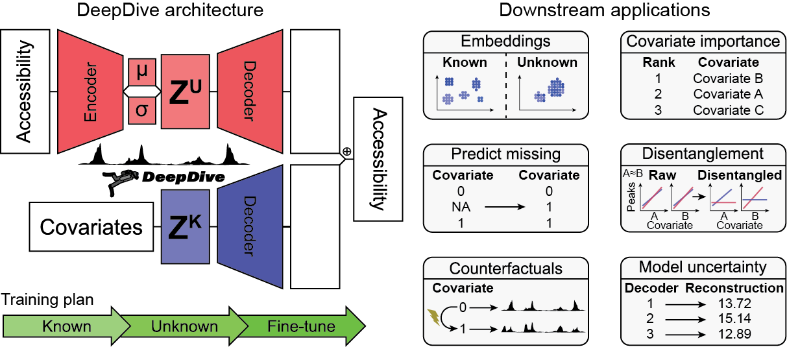

# DeepDive: Disentangled Deep Generative Modeling for Single-Cell Chromatin Accessibility

**DeepDive** is a deep learning framework for **single-cell ATAC-seq** data that disentangles biological and technical covariates using a **conditional variational autoencoder** with **adversarial regularization**.  
It enables:
- **Counterfactual prediction** (simulate e.g., unseen cell–donor combinations)  
- **Covariate-controlled comparisons**  
- **Interpretation of regulatory variation** across cells and conditions  

<p align="center">
  
</p>

## Key Features

- **Disentangled representation learning** — separate biological signals (e.g., cell type) from confounders (e.g., batch, sex, BMI).  
- **Counterfactual reconstruction** — predict accessibility for unseen combinations of covariates.  
- **Flexible design** — supports both discrete (e.g., batch) and continuous (e.g., BMI) covariates.  

## Conceptual Overview

DeepDive models each cell’s chromatin accessibility profile \( x \) as a combination of:
- **Known covariates** (e.g., cell type, sex, batch)
- **Unknown latent variation**

It learns to disentangle these through a **conditional variational autoencoder** and an **adversarial network** that penalizes covariate leakage into the latent space.

## Documentation

Documentation and tutorials are available at [here](https://deepdive-tutorial.readthedocs.io/).

Tutorials include:

- Data preprocessing
- Model training
- Effect size estimation
- Counterfactual prediction

## Installation

DeepDive can be installed from Github:
```bash
git clone https://github.com/madsen-lab/DeepDive.git
cd DeepDive
pip install -e .
```

## Dependencies

- Python ≥ 3.9
- PyTorch ≥ 2.0
- Scanpy
- NumPy / Pandas / Seaborn / Matplotlib

## Citation 
If you find DeepDive useful in your research, please consider citing our manuscript:
```
@article{moeller2025DeepDIVE,
  title={Disentangling covariate effects on single cell-resolved epigenomes with DeepDive},
  author={Moeller, Andreas and Madsen, Jesper},
  journal={BioRxiv},
  year={2025}
  }
```